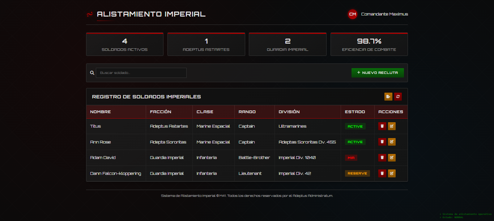

# CRUD Imperial Warhammer 40K

## 🪐 Alistamiento Imperial – CRUD Warhammer 40K



## 📜 Descripción General

Sistema CRUD (Create, Read, Update, Delete) para gestionar soldados del Imperio de la Humanidad.  
Construido con **HTML5**, **CSS3**, y **JavaScript Vanilla**, manteniendo una estética gótica-futurista inspirada en Warhammer 40,000.

**Frontend (HTML/CSS):** DeepSeek AI  
**Lógica JavaScript:** Desarrollo humano

---

## 🎨 Diseño y Estética

### 🎨 Paleta de Colores Imperial

```css
:root {
  --primary-dark: #0a0a0a;
  --primary-red: #8b0000;
  --accent-red: #b30000;
  --text-light: #e0e0e0;
  --text-gray: #aaaaaa;
  --panel-dark: #1a1a1a;
  --border-dark: #333333;
  --success-green: #0a6b0a;
  --warning-orange: #b36b00;
  --danger-red: #8b0000;
}
```

## 🏛️ Identidad Visual

Orbitron: Tipografía principal

Cinzel: Elementos decorativos y el Águila Imperial

Font Awesome 6.4.0: Iconos

Glow rojo, gradientes y bordes angulares

Terminología fiel al lore 40K

# 🏗️ Arquitectura del Sistema

### 1. Header Imperial

Incluye Águila Imperial, título y usuario.

### 2. Panel de Estadísticas

Total de soldados

Filtros por facción (Adeptus Astartes, Guardia Imperial, etc.)

Métricas demostrativas

### 3. Sistema de Búsqueda Avanzada

Filtrado instantáneo en tiempo real

Sin recarga de página

### 4. Tabla Dinámica de Soldados

Renderizada completamente mediante JavaScript.

### 5. Sistema Modal Dual

Modal Crear/Editar

Modal Confirmación para eliminar

## ⚡ Lógica JavaScript (Humana, no servida por máquinas herejes)

```javascript
✨ Estructura de Datos
{
fullname: "Cassian Valerius",
facction: "Adeptus Astartes",
classSoldier: "Marine Espacial",
rankSoldier: "Sergeant",
division: "Ultramarines",
statusSoldier: "active"
}
```

## 💾 Persistencia con localStorage

```javascript
const soldiersList = JSON.parse(localStorage.getItem("soldiersList")) || [];
localStorage.setItem("soldiersList", JSON.stringify(soldiersList));
```

## 📝 CREATE

```javascript
saveSoldierBtn.addEventListener("click", () => {
  if (validaciónCompleta()) {
    soldiersList.push(nuevoSoldado);
    localStorage.setItem("soldiersList", JSON.stringify(soldiersList));
    renderSoldiers();
    resetForm();
  }
});
```

## 👁️ READ

```javascript
function renderSoldiers(data = soldiersList) {
  // Render dinámico + estadísticas
}
```

## ✏️ UPDATE

```javascript
function editData(index) {
  const soldier = soldiersList[index];
  fillForm(soldier);
  soldiersList.splice(index, 1);
  modal.classList.add("active");
}
```

## 🗑️ DELETE

```javascript
function deleteData(index) {
  deleteModal.classList.add("active");
  confirmDeleteBtn.onclick = () => {
    soldiersList.splice(index, 1);
    localStorage.setItem("soldiersList", JSON.stringify(soldiersList));
    renderSoldiers();
    deleteModal.classList.remove("active");
  };
}
```

## 🎯 Estados del Sistema

Estado Color Descripción
active 🟢 Verde En servicio
reserve 🟠 Naranja En reserva
mia 🔴 Rojo Desaparecido
📊 Facciones Disponibles

Adeptus Astartes

Guardia Imperial

Adeptus Mechanicus

Adeptus Custodes

Inquisición

Adepta Sororitas

Rangos Militares

Initiate → Battle-Brother → Sergeant → Lieutenant → Captain → Chapter Master
Commissar → Magos → Lord Inquisitor

## 🚀 Flujo de Trabajo

Nuevo Recluta → Formulario → Guardar

Editar Soldado → Formulario autocompletado

Eliminar → Confirmación

Buscar → Filtrado en vivo

## 📱 Responsive Design

Desktop: Tabla completa

Tablet: Scroll horizontal

Mobile: Layout vertical

## 🛠️ Instalación y Uso

Descargar el proyecto

Abrir el HTML en cualquier navegador moderno

Listo, funciona completamente del lado del cliente

Requiere: Navegador moderno + JS habilitado
No requiere: Servidor, BD, frameworks

## 🔧 Personalización

Nuevas Facciones

<option value="Grey Knights">Grey Knights</option>

Nuevos Estados
wounded: "Herido",
retired: "Retirado"

## 🔮 Mejoras Futuras

Exportar PDF/Excel

Sistema de backup/restore

Filtros avanzados

Toasts de notificación

Temas (Imperio / Caos / Xenos)

## 🐛 Problemas Comunes

No guarda datos: localStorage deshabilitado

Fuentes no cargan: falta conexión

JS falla: revisar consola del navegador

## 🤝 Créditos

Frontend: DeepSeek AI

JavaScript: Humano leal al Imperio

QA: Adeptus Administratum

## 🦅 ¡POR EL EMPERADOR!

### La vida es la moneda del Emperador, gástala bien.

Sistema de Alistamiento Imperial © M41
